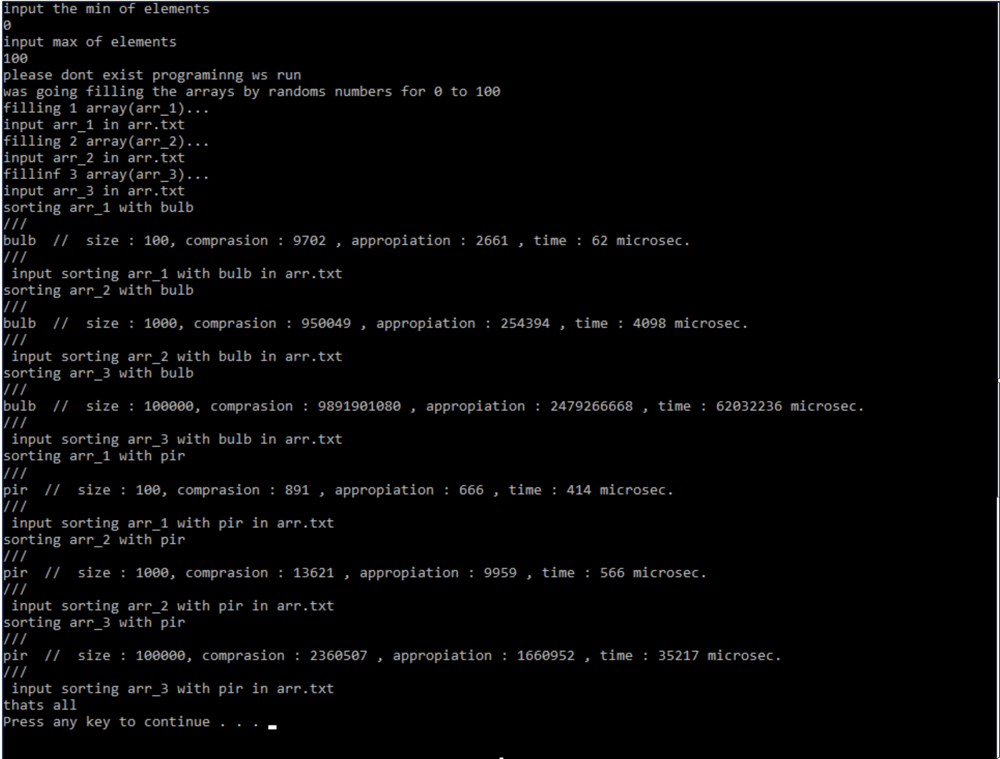

# CPP_Comprasion_BublAndHeap_Sort
There you can find difference between bubl and heap sort

And how was time depend with different amount of array elemants and algoritm.

You can see some result on screenshoot.

